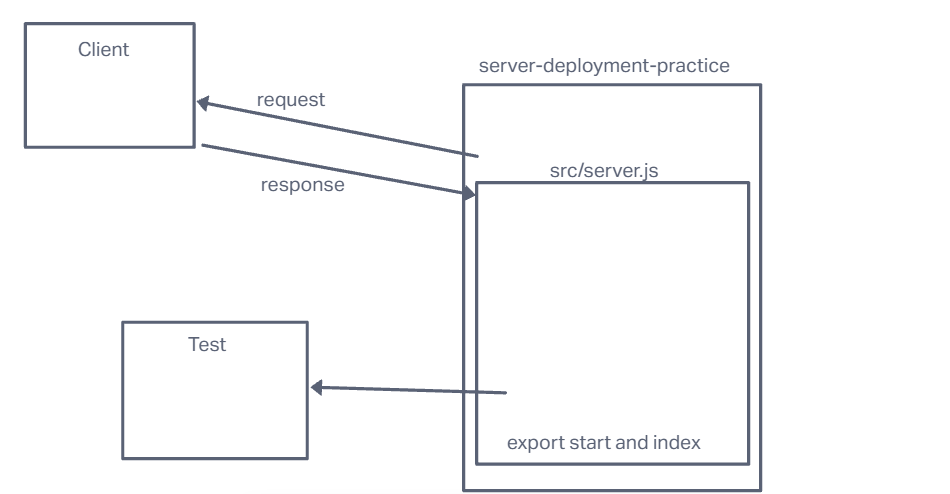

# LAB - Class 01

## Project: server-deployment-practice

### Author: Emmanuel Gonzales

### Problem Domain  

This very basic express server is used as a base for CI/CD deployment exercises

### Links and Resources

- [GitHub Actions ci/cd](https://github.com/rkgallaway/server-deployment-practice-d51/actions)
- [back-end dev server url](http://xyz.com)
- [back-end prod server url](http://xyz.com)

### Collaborators

Used some code from Ryan Gallaway

401d53

### Setup

#### `.env` requirements (where applicable)

User Port

#### How to initialize/run your application (where applicable)

clone repo, `npm init`, run `nodemon` in the terminal

#### Routes

- GET : `/`
- GET : `/success`

#### Tests

to run tests, after running `npm i`, run the command `npm test`

#### UML

